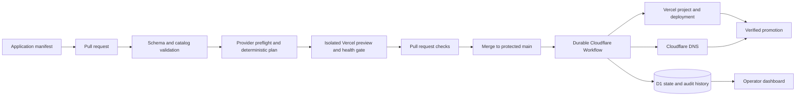

<div align="center">

# Launchpad

**A Git-driven control plane for Vercel applications and Cloudflare DNS.**

[](https://github.com/carterlasalle/launchpad-platform/actions/workflows/ci.yml)


[Getting started](docs/guides/getting-started.md) · [Deploy the control plane](docs/guides/deployment.md) · [Manage applications](docs/guides/managing-applications.md) · [Operations](docs/runbooks/README.md) · [Master plan](docs/Launchpad_Unified_GitOps_Master_Plan.md)

</div>

Launchpad gives a small platform team the operating model of a mature GitOps system without Kubernetes, Terraform, OpenTofu, or a custom GitHub App. Application owners declare desired state in YAML. Pull requests receive provider-aware plans and real Vercel previews. Merged changes are applied by durable Cloudflare Workflows, recorded in D1, verified through health and DNS gates, and exposed through an operator dashboard.

## How it works



Git is the desired-state source of truth. Provider dashboards are observed state. D1 stores resource ownership, workflow progress, deployment history, health, drift, incidents, and audit records; it does not become a second desired-state store.

## Capabilities

| Area | What Launchpad provides |
|---|---|
| Catalog | Strict JSON Schema, YAML source locations, canonicalization, dependency validation, lifecycle policy, zone registry, and duplicate detection |
| Planning | Provider-aware resource graph, deterministic operations, downstream effects, policy results, redacted JSON/Markdown artifacts, and stable fingerprints |
| Pull requests | Real shadow Vercel projects, exact-commit build polling, independent health checks, sticky reports, stale-plan protection, and required status checks |
| Delivery | Idempotent durable workflows, step-level persistence, D1 locks, staged production candidates, exact promotion, and known-good rollback |
| Networking | Cloudflare DNS ownership tracking, authoritative verification, Vercel domain/TLS readiness, and explicit proxy compatibility gates |
| Reconciliation | Scheduled provider observation, drift fingerprints, one open reconciliation PR per drift, and restore/adopt modes |
| Lifecycle | Missing-manifest blocking, decommission cooling-off, single-use approval tokens, ordered teardown, tombstones, and resumable cleanup |
| Operations | Authenticated dashboard, direct retry/recheck/rollback/cancel controls, structured logs, metrics, incidents, DLQ handling, and audit history |
| Security | Purpose-separated credentials, GitHub Actions OIDC, signature-verified webhooks, secret redaction, pinned Actions, least-privilege workflow permissions, and fail-closed gates |

## Quick start

### Prerequisites

- Node.js `24.18.0` (pinned in [`.node-version`](.node-version))
- Corepack with Yarn `4.10.3`
- Git

```bash
corepack enable
yarn install --immutable
yarn platform validate --catalog catalog
yarn typecheck
yarn test
```

Run the complete deterministic release matrix:

```bash
yarn acceptance:offline
```

### Run the control plane locally

```bash
yarn build
yarn wrangler d1 migrations apply DB --local
yarn wrangler dev --local
```

The dashboard is available at `http://localhost:8787`; the controller health endpoint is `http://localhost:8787/healthz`. Local D1 state is stored under the git-ignored `.wrangler/` directory. Provider-changing flows still require explicit provider credentials and should target disposable resources.

For environment setup, provider preflight, and local command examples, follow the [getting-started guide](docs/guides/getting-started.md).

## Application workflow

1. Copy and edit a manifest under `catalog/apps/`.
2. Declare every managed Cloudflare zone in `catalog/zones.yaml`.
3. Validate locally with `yarn platform validate --catalog catalog`.
4. Open a pull request.
5. Review the exact plan, downstream effects, preview URL, build state, and health result.
6. Pass the required checks and merge the pull request.
7. Launchpad revalidates the merged state, applies through the controller, stages a production candidate, verifies it, and promotes the exact deployment.

Start with [`catalog/apps/fixture.yaml`](catalog/apps/fixture.yaml) and the [application management guide](docs/guides/managing-applications.md). The schema contract is [`schema/app.schema.json`](schema/app.schema.json).

## Architecture

Launchpad is a Yarn workspace with deliberately narrow package boundaries:

```text
apps/
  cli/                    Operator and workflow CLI
  controller/             Cloudflare Worker API and durable dispatch
  dashboard/              Authenticated operator interface
packages/
  catalog/                YAML loading, schema, canonicalization, semantics
  core/                   Domain model, graph, diff, policy, plan, fingerprints
  database/               D1 and in-memory persistence contracts
  github-reporting/       PR comments, artifacts, deployment reporting
  health/                 Health-check engine
  provider-contract/      Provider-neutral interfaces and typed errors
  provider-{github,vercel,cloudflare,secrets}/
workflows/                 Durable apply, preview, reconcile, and decommission machines
migrations/d1/             Forward-only control-plane schema
catalog/                   Desired application state and zone registry
```

Provider SDK types do not leak into the planner. Every adapter implements the shared provider contracts and is exercised by common contract tests.

## Safety model

Launchpad intentionally makes dangerous paths inconvenient:

- Normal apply rejects `DESTROY` before the first provider write.
- Removing a manifest produces `BLOCKED_MISSING_MANIFEST`; it is not deletion authorization.
- Production remains on the prior deployment until the candidate passes its gates.
- Rollback targets only a deployment recorded as known-good after post-promotion health succeeded.
- Proxied DNS requires explicit acknowledgement and origin/public compatibility checks.
- Plans are bound to desired state, observed state, capability state, commit, and reviewed fingerprint.
- Unreviewed pull-request source code never receives production provider or report-writing credentials: credentialed jobs execute the trusted base-commit CLI against a sparse checkout containing only the proposed catalog. Forks receive only unprivileged validation.
- Secrets are references or typed secret bindings; plaintext values are prohibited from Git, D1, logs, comments, and artifacts.

The normative requirements are in the [Unified GitOps Master Plan](docs/Launchpad_Unified_GitOps_Master_Plan.md). Architectural decisions are indexed in the [ADR directory](docs/adr/README.md).

## Deployment status

Production-changing workflows are **dormant by default**. `Launchpad Apply` and scheduled reconciliation run only when the repository variable `LAUNCHPAD_CONTROL_PLANE_ENABLED` is exactly `true`; any other nonempty value fails the mode gate. Control-plane deployment renders that same value into the Worker and its provider-event reconciliation gate. During the handoff before that deployment passes smoke, the controller rejects automatic apply and GitHub-scheduled reconciliation with `LP-CONTROL-PLANE-DISABLED`, before any provider write. A `bootstrap=true` dispatch can deploy the Worker with the runtime gate still false. This prevents a newly cloned or incompletely configured repository from reporting false-green production automation.

Before enabling the control plane:

1. Provision the documented Cloudflare resources and Worker Secrets Store entries.
2. Configure GitHub repository and environment variables/secrets.
3. Apply and verify the `launchpad-main` ruleset.
4. Run the offline acceptance suite.
5. Run live acceptance against dedicated sandbox resources.
6. Complete the [release checklist](docs/release-checklist.md).

The complete sequence is in [Deploying Launchpad](docs/guides/deployment.md).

## Documentation

| Document | Purpose |
|---|---|
| [Documentation index](docs/README.md) | Guides, design records, runbooks, and specifications |
| [Getting started](docs/guides/getting-started.md) | Install, validate, run locally, and use provider preflight |
| [Deployment guide](docs/guides/deployment.md) | Bootstrap Cloudflare, GitHub, credentials, rulesets, and production workflows |
| [Managing applications](docs/guides/managing-applications.md) | Author manifests and understand PR, apply, drift, and decommission flows |
| [Runbook index](docs/runbooks/README.md) | Incident response and operational recovery |
| [Release checklist](docs/release-checklist.md) | Static, sandbox, security, and production release gates |
| [Contributing](CONTRIBUTING.md) | Development workflow and pull-request standards |
| [Agent guidance](AGENTS.md) | Repository-specific instructions for coding agents |

## Contributing

This repository uses protected, squash-only pull requests with required checks. Solo-owner mode keeps direct pushes blocked without requiring a second reviewer account. Read [CONTRIBUTING.md](CONTRIBUTING.md) before making changes. Run `yarn docs:check` when editing documentation and `yarn acceptance:offline` before proposing a release.
